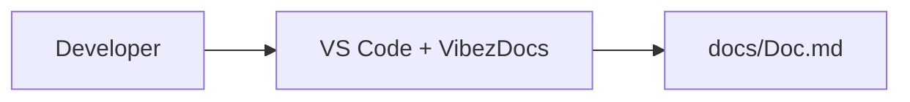

# VibezDocs

## Architecture
- backend unknown activity detected in memory.py
- backend unknown activity detected in .env
- • **Updated .env file**: The .env file has been updated with 2 new additions, including a Groq API key and model, and backend m...
- • **Added configuration settings**: The updated .env file now includes configuration settings for Groq, chatbot server port, an...

## APIs
- (none yet)

## Components
- (none yet)

## Database
- (none yet)

## Pages
- (none yet)

## Development Timeline
- 2026-05-01T18:00:03.321Z: Updated in memory.py (unknown)
- 2026-05-02T04:28:55.864Z: Updated in .env (unknown)

## C4 Diagram (Mermaid format)

